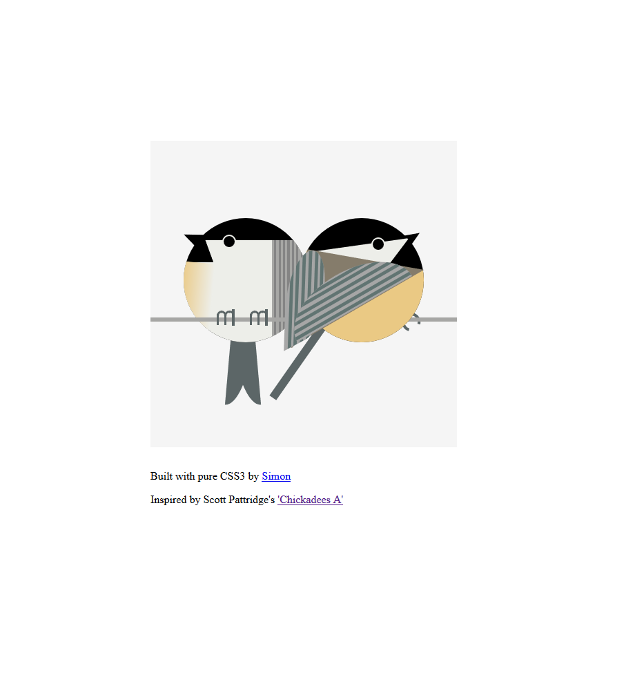

# CSS-Chickadees

> An illustration of two chickadees made with pure CSS3.

---

## Built With

- HTML5
- CSS3
- Node
- Font Awesome
- Google Fonts

## Live Demo

[Live Demo Link](https://simonpeterdebbarma.github.io/css-chickadees)

---

### Prerequisites

- Node.js (for Browersync and Stylelint)
- Web Browser
- CLI
- IDE

### Dependencies

- Browsersync
- Stylelint

### Install

`git clone`

`npm install`

### Run Linter Test

`stylelint "*/*.css"`

> https://stylelint.io/user-guide/cli

### Autofix CSS Linting Errors

`stylelint "*/**.css" --fix`

### Deployment

`npm start`

---

## Authors

👤 **Simon Peter Debbarma**

- Github: [@simonpeterdebbarma](https://github.com/simonpeterdebbarma)
- Twitter: [@simonpdebbarma](https://twitter.com/simonpdebbarma)
- Linkedin: [Linkedin](https://www.linkedin.com/in/simon-peter-debbarma/)
- Keybase: @simonpd

---

## 🤝 Contributing

Contributions, issues and feature requests are welcome!

Feel free to check the [issues page](issues/).

## Show your support

Give a ⭐️ if you like this project!

## Acknowledgments

- [Scott Pattridge](https://jevaart.com/artworkprints.htm)
---

## 📝 License

This project is [MIT](/LICENSE) licensed.

---
